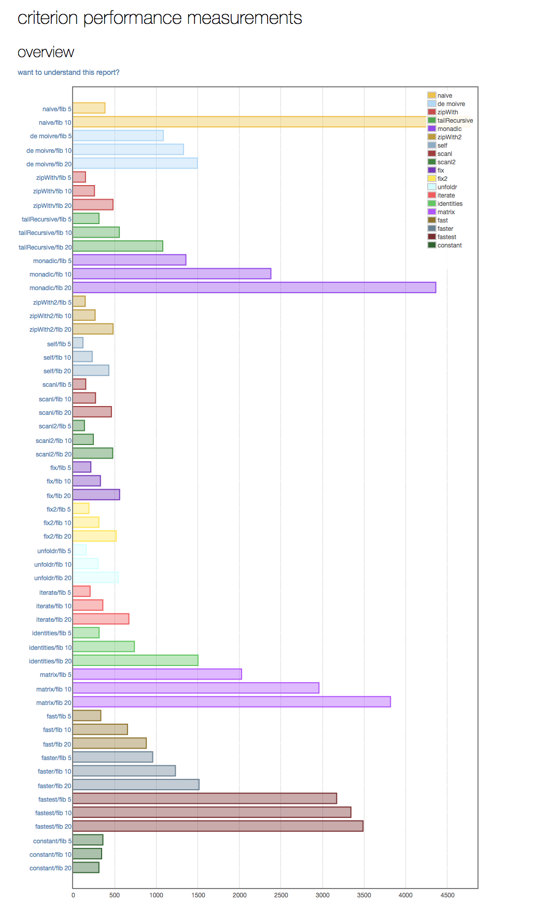

## A benchmark of various implementations of the Fibonacci sequence (written in Haskell using Criterion)

This repo implements a [benchmark](https://github.com/bos/criterion) to compare [a variety of options](https://wiki.haskell.org/The_Fibonacci_sequence) how to implement the [Fibonacci](https://en.wikipedia.org/wiki/Fibonacci_number) sequence.

To make it work you need to ...

* install `stack` with `brew install haskell-stack`
* build the benchmark with `stack ghc -- Fib.hs -o fib`
* run the benchmark with `./fib --output fib.html`
* look at the [output](./fib.html)

And the winner is ... <drum-roll>**constant**</drum-roll>!!!

