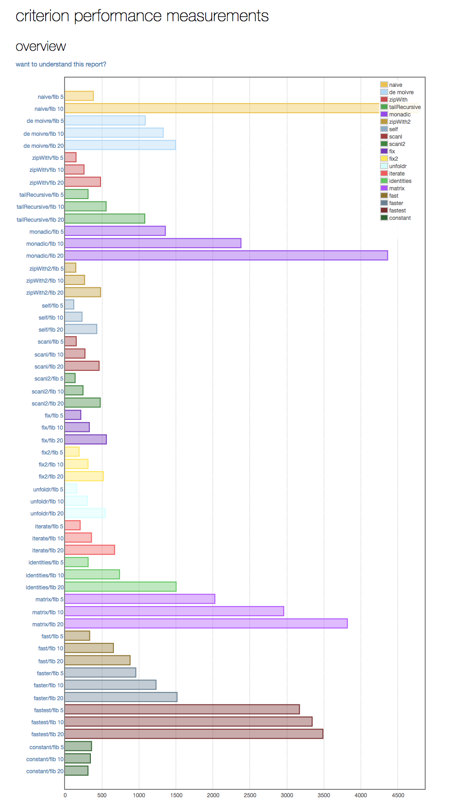

## A benchmark of various implementations of the Fibonacci sequence (written in Haskell using Criterion)

This repo implements a [benchmark](https://github.com/bos/criterion) to compare [a variety of options](https://wiki.haskell.org/The_Fibonacci_sequence) how to implement the [Fibonacci](https://en.wikipedia.org/wiki/Fibonacci_number) sequence.

To make it work you need to ...

* install git (`brew install git`)
* install stack (`brew install haskell-stack`)
* clone the repo (`git clone ...`)
* build the benchmark (`stack build`)
* test the benchmark (`stack test`)
* run the benchmark (`stack exec -- fib-bench --output report/$(date '+%Y%m%d%H%M%S').html`)
* look at the report

And the winner is ... <drum-roll>**constant**</drum-roll>!!!

